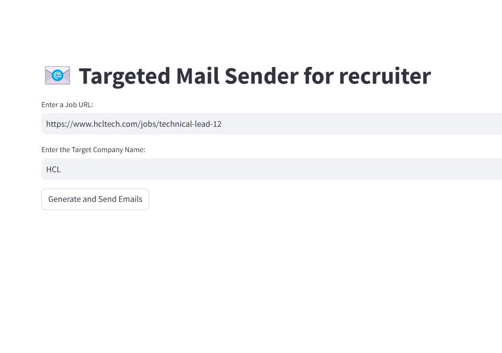
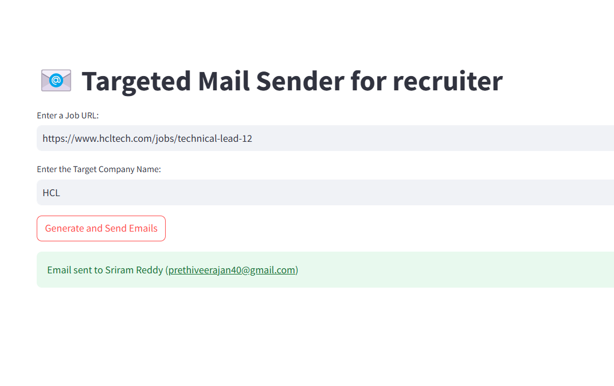
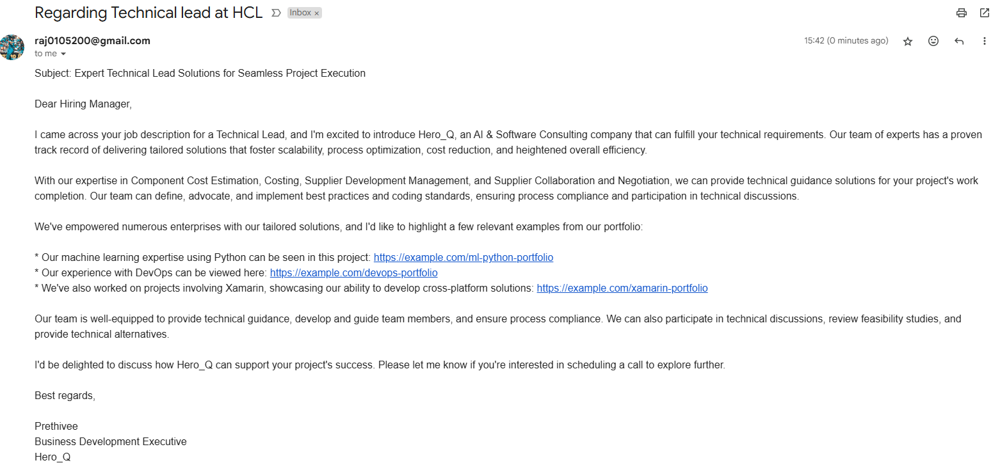

# Targeted Mail Sender for Recruiters  

## Introduction  
The **Targeted Mail Sender for Recruiters** is an AI-driven application designed to automate the process of extracting job postings, generating personalized cold emails, and sending them to HR representatives. This tool utilizes **LangChain**, **ChromaDB**, and **Streamlit** to streamline recruitment communication.  

---

## Key Features  

###  Job Posting Extraction  
- Scrapes job postings from career page URLs.  
- Outputs job details in a structured JSON format with keys: `role`, `experience`, `skills`, and `description`.  

###  Cold Email Generation  
- Creates personalized emails using **LangChain - ChatGroq** based on job descriptions.  
- Enhances emails with company achievements and portfolio details for credibility.  

###  Portfolio Integration  
- Leverages **ChromaDB** to match job-required skills with relevant company projects.  
- Provides dynamic suggestions from the stored portfolio to include in the email.  

### Email Sending  
- Sends personalized emails to HR contacts listed in a CSV file.  
- Dynamically filters HR contacts based on the target company name using Python's `smtplib`.  

###  Streamlit User Interface  
- User-friendly UI built with **Streamlit** for inputting URLs and managing communication.  
- Displays real-time email delivery status and error messages, if any.  

---

## Prerequisites  

### Software Requirements  
- **Python 3.10+**  

###  Environment Variables  
- `GROQ_API_KEY`: Your API key for LangChain's ChatGroq model.  

### Required Python Packages  
- `langchain_groq`  
- `streamlit`  
- `smtplib`  
- `chromadb`  
- `pandas`  
- `dotenv`  

---

## File Overview  

###  `chains.py`  
- Defines the `Chain` class to handle job extraction and cold email generation.  

### `portfolio.py`  
- Manages the portfolio database and retrieves relevant projects using **ChromaDB**.  

### `main.py`  
- Main Streamlit application that integrates the components, enabling user interaction.  

###  Resources  
- **`Hr_list.csv`**: Contains HR contact details (Name, Email, Company, Location).  
- **`my_portfolio.csv`**: Stores projects and achievements with associated skills and links.  

---

## How to Install and Run  

###  Clone the Repository  
```bash  
git clone https://github.com/Prethiveerajan/Automated_job_application_generator.git  
cd Automated_job_application_generator  
```  

### Install Dependencies  
```bash  
pip install -r requirements.txt  
```  
### Configure Environment  
1. Create a `.env` file in the root directory.  
2. Add your API key:  
   ```plaintext  
   GROQ_API_KEY=your_groq_api_key  
   ```  

### Start the Streamlit App  
```bash  
streamlit run main.py  
```  

---

## Usage Instructions  

1. **Input the Career Page URL**: Paste a job posting URL.  
2. **Specify the Target Company Name**: Enter the name of the target company.  
3. **Generate Emails**: Click "Generate and Send Emails."  
4. **Check Status**: View real-time status updates on email delivery.  

---

## Example Workflow  

1. **Enter Job URL**: For example, `https://www.hcltech.com/jobs/technical-lead-12`.  
2. **Specify Target Company**: Example: "HCL".  
3. **Execution**:  
   - Scrapes job postings from the URL.  
   - Matches required skills to relevant projects in your portfolio.  
   - Generates and sends personalized emails to HR contacts listed in `Hr_list.csv`.  

---

## Potential Improvements  

### Future Enhancements  
- Add multi-language support for global outreach.  
- Enable scheduling for emails to be sent at optimal times.  
- Integrate analytics for tracking email engagement (open rates, responses).  

---  

This project simplifies and automates recruitment outreach, allowing recruiters to save time while sending effective, personalized emails.
## Output:



## Automated mail:


## Architecture Diagram


